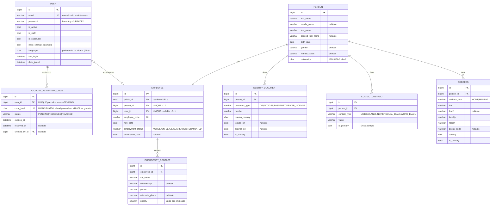
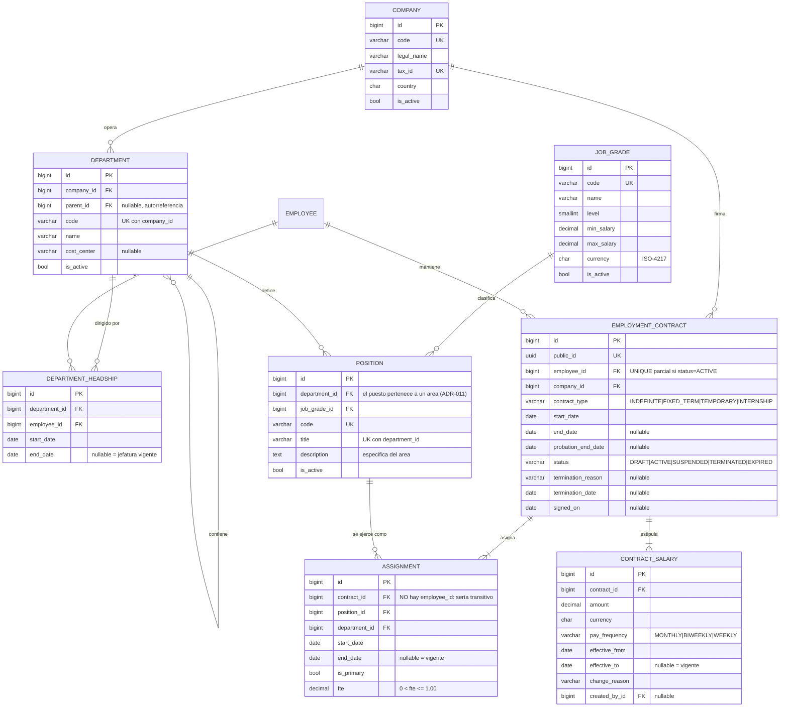
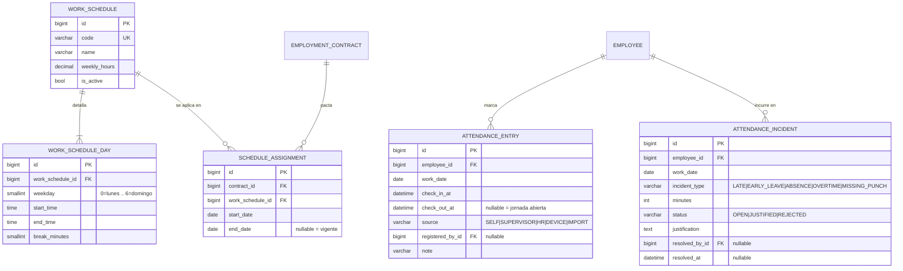
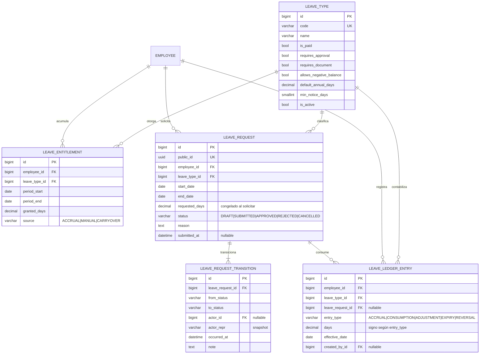
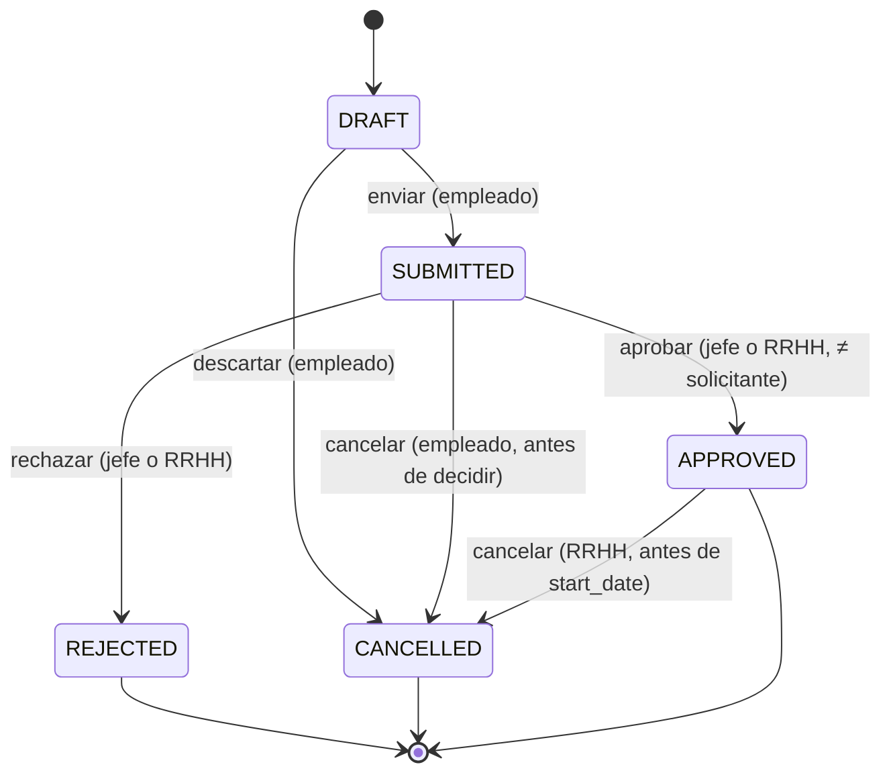
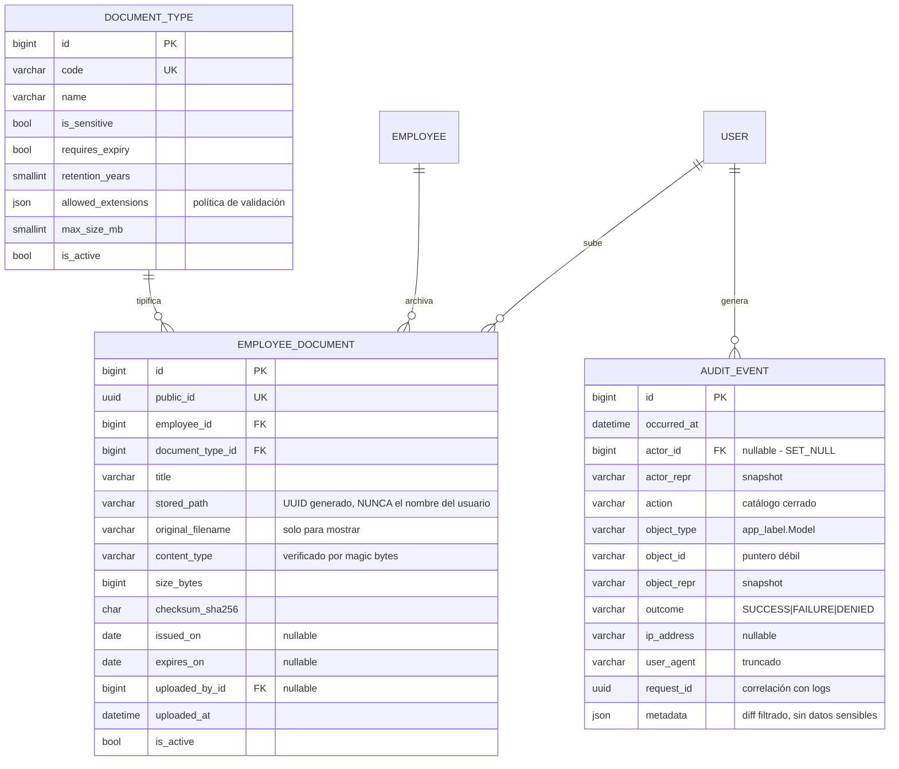
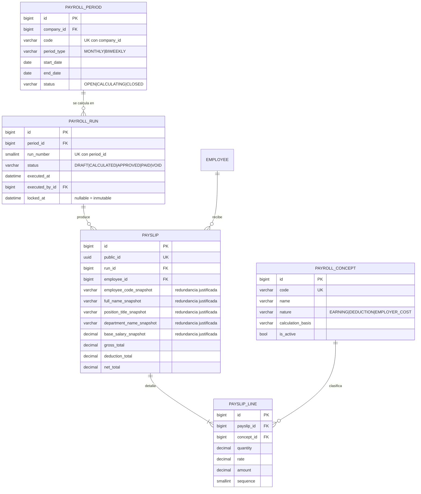

# F. Diagrama entidad-relación (ERD)

Los diagramas se escriben en **Mermaid** para que sean versionables en Git y
revisables en un diff (regla 24). Se mantienen sincronizados con el modelo: todo
cambio de esquema que altere una entidad o una relación **debe** actualizar este
archivo en el mismo commit.

Notación de cardinalidad Mermaid usada:

| Símbolo | Significado |
|---|---|
| `\|\|--\|\|` | uno y solo uno ↔ uno y solo uno |
| `\|\|--o{` | uno ↔ cero o muchos |
| `\|\|--\|{` | uno ↔ uno o muchos |
| `}o--\|\|` | cero o muchos ↔ uno |
| `\|o--o\|` | cero o uno ↔ cero o uno |

---

## F.1 Vista global

Relaciones únicamente, sin atributos, para poder leer la estructura completa.
Las entidades de nómina (Fase 8) se muestran en gris conceptual: su diseño
detallado es posterior.

```mermaid
erDiagram
    COMPANY ||--o{ DEPARTMENT : "opera"
    COMPANY ||--o{ EMPLOYMENT_CONTRACT : "firma"
    COMPANY ||--o{ HOLIDAY : "define"

    USER |o--o| EMPLOYEE : "accede como"
    USER ||--o{ AUDIT_EVENT : "genera"
    USER ||--o{ ACCOUNT_ACTIVATION_CODE : "activa con"

    PERSON ||--|| EMPLOYEE : "es"
    PERSON ||--o{ IDENTITY_DOCUMENT : "se identifica con"
    PERSON ||--o{ CONTACT_METHOD : "se contacta por"
    PERSON ||--o{ ADDRESS : "reside en"

    EMPLOYEE ||--o{ EMERGENCY_CONTACT : "declara"
    EMPLOYEE ||--o{ EMPLOYMENT_CONTRACT : "mantiene"
    EMPLOYEE ||--o{ DEPARTMENT_HEADSHIP : "jefatura"
    EMPLOYEE ||--o{ LEAVE_REQUEST : "solicita"
    EMPLOYEE ||--o{ LEAVE_ENTITLEMENT : "acumula"
    EMPLOYEE ||--o{ LEAVE_LEDGER_ENTRY : "registra"
    EMPLOYEE ||--o{ ATTENDANCE_ENTRY : "marca"
    EMPLOYEE ||--o{ ATTENDANCE_INCIDENT : "incurre en"
    EMPLOYEE ||--o{ EMPLOYEE_DOCUMENT : "archiva"
    EMPLOYEE ||--o{ PAYSLIP : "recibe"

    DEPARTMENT ||--o{ DEPARTMENT : "contiene"
    DEPARTMENT ||--o{ DEPARTMENT_HEADSHIP : "es dirigido por"
    DEPARTMENT ||--o{ POSITION : "define"

    JOB_GRADE ||--o{ POSITION : "clasifica"
    POSITION ||--o{ ASSIGNMENT : "se ejerce como"

    EMPLOYMENT_CONTRACT ||--|{ CONTRACT_SALARY : "estipula"
    EMPLOYMENT_CONTRACT ||--|{ ASSIGNMENT : "asigna"
    EMPLOYMENT_CONTRACT ||--o{ SCHEDULE_ASSIGNMENT : "pacta jornada"

    WORK_SCHEDULE ||--|{ WORK_SCHEDULE_DAY : "detalla"
    WORK_SCHEDULE ||--o{ SCHEDULE_ASSIGNMENT : "se aplica en"

    LEAVE_TYPE ||--o{ LEAVE_REQUEST : "clasifica"
    LEAVE_TYPE ||--o{ LEAVE_ENTITLEMENT : "otorga"
    LEAVE_TYPE ||--o{ LEAVE_LEDGER_ENTRY : "contabiliza"
    LEAVE_REQUEST ||--|{ LEAVE_REQUEST_TRANSITION : "transiciona"
    LEAVE_REQUEST ||--o{ LEAVE_LEDGER_ENTRY : "consume"

    DOCUMENT_TYPE ||--o{ EMPLOYEE_DOCUMENT : "tipifica"

    PAYROLL_PERIOD ||--o{ PAYROLL_RUN : "se calcula en"
    PAYROLL_RUN ||--o{ PAYSLIP : "produce"
    PAYSLIP ||--|{ PAYSLIP_LINE : "detalla"
    PAYROLL_CONCEPT ||--o{ PAYSLIP_LINE : "clasifica"
```

**Lecturas clave del diagrama:**

1. `EMPLOYEE` tiene muchas relaciones salientes pero **pocos atributos propios**:
   es un nodo de identidad, no un depósito de datos (regla 13).
2. No hay ninguna arista directa `EMPLOYEE → DEPARTMENT` ni `EMPLOYEE → POSITION`.
   El camino es `EMPLOYEE → EMPLOYMENT_CONTRACT → ASSIGNMENT → POSITION → DEPARTMENT`,
   porque la ocupación de un puesto es un hecho con vigencia y el departamento se
   deriva del puesto.
3. `AUDIT_EVENT` solo se conecta con `USER`, y con FK opcional: la auditoría no
   depende del ciclo de vida de lo auditado.

---

## F.2 Núcleo de identidad (`accounts` + `employees`)

---

## F.3 Organización y relación laboral (`departments` + `positions` + `contracts`)

Este es el subdominio donde se concentran las decisiones de normalización.

**Anotaciones de diseño visibles en el diagrama:**

- `ASSIGNMENT` es la **entidad asociativa** que resuelve la relación N:M
  empleado↔puesto. Lleva los atributos propios de la relación (`start_date`,
  `end_date`, `is_primary`, `fte`), tal como exige la regla 8.
- `ASSIGNMENT` **no contiene ninguna referencia redundante**, y las dos que
  faltan lo son por el mismo motivo: `employee_id` sería transitivo vía el
  contrato, y `department_id` sería transitivo vía el puesto
  ([§D.5.3](04-normalizacion.md#d5-tercera-forma-normal-3nf) y
  [§D.5.4](04-normalizacion.md#d5-tercera-forma-normal-3nf)).
- `POSITION` **sí** contiene `department_id`: el negocio confirmó que ningún
  título es transversal ([ADR-011](../decisions/ADR-011-position-pertenece-a-departamento.md)).
- El rango salarial vive en `JOB_GRADE`, no en `POSITION` (3NF).
- La jefatura es una entidad temporal, no una columna `manager_id`.

---

## F.4 Asistencia (`attendance`, Fase 5)

> `ATTENDANCE_ENTRY.employee_id` apunta al empleado y no al contrato, a
> diferencia de `ASSIGNMENT`. Motivo: el marcaje es un hecho de la persona en una
> fecha; el contrato vigente en esa fecha se determina por consulta y puede no
> existir (RN-52 lo valida). Acoplar el marcaje al contrato complicaría la
> corrección de datos en el límite entre dos contratos consecutivos.

---

## F.5 Ausencias (`leave`, Fase 6)

### Máquina de estados de `LEAVE_REQUEST` (RN-45)

Toda transición produce un `LEAVE_REQUEST_TRANSITION`; las que afectan al saldo
producen además un `LEAVE_LEDGER_ENTRY`. **Ningún otro camino es válido**, y la
implementación rechaza transiciones no declaradas en lugar de asumirlas.

---

## F.6 Documentos y auditoría (`documents` + `audit`)

`AUDIT_EVENT` se dibuja deliberadamente **sin** aristas hacia las entidades
auditadas: la referencia es un puntero débil (`object_type` + `object_id`) y no
una FK, para que el evento sobreviva al borrado del objeto
(ver [B.11](02-modelo-relacional.md)).

---

## F.7 Nómina (`payroll`, Fase 8 — anteproyecto)

> **Advertencia:** este diagrama es tentativo. La nómina se diseñará en detalle al
> inicio de la Fase 8, con su propio análisis de dominio. No debe implementarse a
> partir de este esquema.

Los campos `*_snapshot` son la aplicación directa de la regla 16 y están
justificados en [§D.7](04-normalizacion.md#d7-redundancia-justificada).

---

## F.8 Mantenimiento del ERD

| Cuándo | Qué hacer |
|---|---|
| Se añade o elimina una entidad | Actualizar F.1 y el diagrama de contexto correspondiente |
| Cambia una cardinalidad | Actualizar ambos diagramas y la tabla A.3 del análisis de dominio |
| Cambia un atributo clave (PK, UK, FK) | Actualizar el diagrama de contexto y el diccionario de datos |
| Cambia un atributo no clave | Basta con actualizar el diccionario de datos |

La revisión de PR debe rechazar una migración que altere relaciones sin
actualizar este documento.
