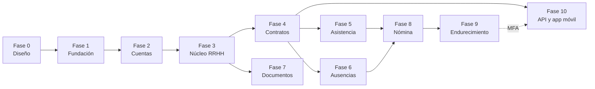

# M. Roadmap de implementación

Construcción incremental (regla 58). Ninguna fase empieza sin que la anterior
cumpla sus criterios de aceptación ([L.7](12-devsecops.md#l7-criterios-de-aceptación-de-una-fase)).

---

## Fase 0 — Análisis y diseño ✅ **cerrada**

**Entregable:** este conjunto de documentos.

- [x] Análisis del dominio, agregados y reglas de negocio
- [x] Modelo relacional con claves y constraints
- [x] Dependencias funcionales
- [x] Normalización (1NF → 5NF) y análisis de anomalías
- [x] ERD en Mermaid
- [x] Diccionario de datos y clasificación de la información
- [x] Política de integridad referencial e índices
- [x] Arquitectura Django y responsabilidades por capa
- [x] Estrategia de autenticación y autorización
- [x] Estrategia de seguridad (CSP, cabeceras, archivos, logging, auditoría)
- [x] Estrategia DevSecOps
- [x] Aprobación del diseño (S-02 y el idioma de los `msgid` resueltos; S-01, S-03, S-05…S-08 siguen abiertos y no bloquean las Fases 1-2)

**Criterio de cierre:** el diseño relacional está revisado y aprobado (regla 69).
**Hasta entonces no se escribe ni un modelo Django.**

---

## Fase 1 — Fundación ✅ **cerrada**

**Objetivo:** que el andamiaje de calidad y seguridad exista *antes* que el código
de dominio.

| Entregable | Detalle |
|---|---|
| Proyecto Django | `config/` con `settings/` separados |
| Variables de entorno | `.env.example`, carga en desarrollo, fallo ruidoso si falta `SECRET_KEY` en producción |
| Base de datos | SQLite; `DATABASE_URL` preparado para PostgreSQL |
| App `core` | `TimeStampedModel`, excepciones de dominio, validadores, `Company`, `Holiday` |
| App `accounts` | **Modelo `User` personalizado** y su migración inicial |
| App `audit` | Modelo `AuditEvent` y el servicio de registro |
| Calidad | Ruff, pytest, coverage, pre-commit, Bandit, pip-audit, detect-secrets |
| CI | Workflow completo, incluido el job de PostgreSQL |
| Seguridad | Cabeceras, CSP en modo *report-only*, cookies, `check --deploy` en verde |
| Frontend | `base.html`, `includes/`, páginas de error, CSS y JS base sin código en línea |
| **i18n** | `USE_I18N`, `LocaleMiddleware`, `LANGUAGES` (`es-gt`, `en`), `locale/`, formatos propios de Guatemala, `User.language`, selector de idioma, verificación de catálogos en CI |
| Documentación | README profesional (regla 53) y los ADR de las decisiones tomadas en esta fase |

**Por qué `User` y `AuditEvent` van aquí y no en fases posteriores:** sustituir el
modelo de usuario después de la primera migración es notoriamente costoso, y la
auditoría debe existir antes del primer evento auditable.

**Criterio de cierre:** el CI pasa entero sobre un proyecto que aún no tiene
lógica de RRHH. Existe al menos un test de humo por cabecera de seguridad.

### Estado

| Entregable | Estado |
|---|---|
| Proyecto, settings por entorno, variables de entorno | ✅ |
| SQLite con `DATABASE_URL` listo para PostgreSQL | ✅ |
| `core` (`TimeStampedModel`, `Company`, `Holiday`, excepciones, logging, middleware) | ✅ |
| `accounts` (`User` propio) y `audit` (`AuditEvent` append-only) | ✅ |
| Ruff, pytest, coverage, pre-commit, Bandit, pip-audit, detect-secrets | ✅ |
| GitHub Actions con 6 trabajos, incluido PostgreSQL y matriz 3.12/3.14 | ✅ |
| CSP, cabeceras de seguridad, `check --deploy` sin advertencias | ✅ |
| i18n: formatos de Guatemala, `User.language`, selector, verificador de catálogos | ✅ |
| Plantillas base, includes y páginas de error | ✅ |
| README | ✅ |
| ADR-001, 002, 003, 005, 006, 007, 008, 009, 010, 013, 018 | ✅ |
| Verificación automática de fronteras entre apps y de ajustes-decisión | ✅ |
| Catálogos `.po` generados | ⏳ requiere `gettext` (no disponible en la máquina de desarrollo); los genera el CI |

Métricas al cierre parcial: **109 pruebas, 95 % de cobertura**, Ruff limpio,
Bandit sin hallazgos, `pip-audit` sin vulnerabilidades, `check --deploy` sin
advertencias.

---

## Fase 2 — Cuentas y acceso ✅ **cerrada**

**Alcance de cuentas decidido: solo RRHH y jefaturas.** La plantilla general
entra en la Fase 6, junto con el portal de autoservicio de ausencias. Esto reduce
el volumen de altas, acota la superficie de ataque y difiere el caso "sin correo
corporativo" al momento en que realmente existe.

| Entregable | Detalle |
|---|---|
| `django-allauth` | Login, logout, verificación de correo, restablecimiento y cambio de contraseña |
| Registro cerrado | Adaptador propio + rutas retiradas + test que lo verifica ([ADR-004](../decisions/ADR-004-alta-de-cuentas-y-registro-cerrado.md)) |
| Invitación por correo | `accounts.services.invite_user`, solo HR_ADMIN, auditada. **Único mecanismo de alta de esta fase** |
| Roles | Los seis grupos y sus permisos, creados por migración de datos idempotente |
| Perfil | Vista propia de perfil y cambio de contraseña |
| Sesiones | Ajustes, invalidación ante cambio de privilegios, `must_change_password` |
| Auditoría | Todos los eventos de [I.6](../security/09-autenticacion.md#i6-eventos-de-autenticación-auditados) |
| Tests | Toda la suite de [I.7](../security/09-autenticacion.md#i7-tests-de-autenticación-fase-2) |
| CSP | Paso de *report-only* a modo bloqueo |

**Criterio de cierre:** ninguna URL del proyecto es accesible sin autenticación
salvo las de acceso, verificado por un test parametrizado sobre **toda** la tabla
de URLs.

### Estado

| Entregable | Estado |
|---|---|
| `django-allauth` conectado, login por correo sin `username` | ✅ |
| Registro cerrado: adaptador + ruta interceptada que responde 404 | ✅ |
| Invitación por correo (`services.invite_user`), auditada y atómica | ✅ |
| Roles: 6 grupos y sus permisos, convergentes en cada `migrate` | ✅ |
| Perfil propio y cambio de contraseña | ✅ |
| Sesiones: invalidación ante cambio de rol o baja; `must_change_password` | ✅ |
| Auditoría de los 9 eventos de acceso de §I.6 | ✅ |
| Listado de cuentas con búsqueda, paginación y alcance | ✅ |
| CSP en **modo bloqueo** en todos los entornos | ✅ |
| Criterio de cierre: cobertura de **toda** la tabla de URLs | ✅ |

Métricas: **290 pruebas (90 de seguridad), 95,8 % de cobertura**, Ruff limpio,
Bandit sin hallazgos, `check --deploy` sin advertencias.

Revisión de seguridad de fase: **aprobada** con dos desviaciones documentadas —
ver [revisión de la Fase 2](../security/revision-fase-2.md). Detectó y corrigió
cuatro hallazgos, dos de ellos de gravedad alta.

**Único pendiente:** los catálogos `.po`, bloqueados por la falta de `gettext` en
la máquina de desarrollo. Los genera el trabajo `i18n` del CI.

---

## Fase 3 — Núcleo de RRHH ✅ **cerrada**

| Entregable | Detalle |
|---|---|
| `employees` | `Person`, `Employee`, `IdentityDocument`, `ContactMethod`, `Address`, `EmergencyContact` |
| `departments` | `Department`, `DepartmentHeadship`, organigrama |
| `positions` | `JobGrade`, `Position` |
| CRUD | Con autorización de tres capas y auditoría |
| Selectores de alcance | `employees_visible_for` y hermanos: **el corazón de la protección contra IDOR** |
| Búsqueda, filtros, paginación | En todos los listados |
| Enmascarado de PII | Según [G.19](../database/06-diccionario-de-datos.md#g19-clasificación-de-datos) |
| Tests | Matriz completa de autorización + suite de IDOR |

**Criterio de cierre:** la matriz de permisos [J.2](../security/10-autorizacion.md#j2-matriz-de-permisos)
está cubierta por tests para cada recurso implementado.

### Estado

| Entregable | Estado |
|---|---|
| `positions`: `JobGrade` y `Position` (con `department`, ADR-011) | ✅ |
| `departments`: `Department` con jerarquía acíclica y `DepartmentHeadship` temporal | ✅ |
| `employees`: `Person`, `Employee`, documentos, contacto, dirección, contactos de emergencia | ✅ |
| Validadores de DPI/CUI, NIT e IGSS y normalización previa a la unicidad | ✅ |
| CRUD con autorización de tres capas y auditoría | ✅ |
| Selectores de alcance y URLs por `public_id` (protección IDOR) | ✅ |
| Enmascarado de PII y registro de accesos sensibles | ✅ |
| Confidencialidad de la banda salarial (selector propio, sin cascada) | ✅ |

Métricas: **709 pruebas, 92,6 % de cobertura**, Ruff, Bandit y `check --deploy` limpios.

Revisión de seguridad: **aprobada** — ver [revisión de la Fase 3](../security/revision-fase-3.md).
Corrigió una exposición latente de contactos personales que se habría activado
al construir la Fase 4.

**Trasladado a la Fase 4:** el alcance de equipo del `MANAGER` (necesita
`Assignment`) y retirar la baja de `employees` para que el estado laboral solo
cambie desde `contracts` (RN-18).

---

## Fase 4 — Relación laboral ✅ **cerrada**

| Entregable | Detalle |
|---|---|
| `contracts` | `EmploymentContract`, `ContractSalary`, `Assignment` |
| Invariantes | RN-13, RN-14, RN-20…RN-26 en servicios transaccionales |
| Historial | Salarial, de puestos y de departamentos, con vistas de consulta |
| Ciclo de vida | Transiciones de estado del contrato + sincronización de `Employee.employment_status` (RN-18) |
| Confidencialidad salarial | Permiso separado; MANAGER y HR_MANAGER excluidos |
| Auditoría | `CONTRACT_*`, `SALARY_CHANGE`, `ASSIGNMENT_*` |
| **Deuda heredada de la Fase 3** | Activar `employees.selectors._team_of` con `Assignment` vigente sobre puestos de los departamentos jefeados, y **reescribir** `test_manager_scope_is_pending_assignments`, que hoy documenta el hueco. Añadir a `deactivate_department` y `deactivate_position` la comprobación de asignaciones vigentes |

**Criterio de cierre:** existe un test de invariante que recorre la base y
verifica la coherencia entre estado de empleado y contratos; los tests de
traslape cubren todas las fronteras.

### Estado

| Entregable | Estado |
|---|---|
| `EmploymentContract`, `ContractSalary`, `Assignment` con restricciones en la base | ✅ |
| Máquina de estados `DRAFT → ACTIVE ⇄ SUSPENDED → TERMINATED / EXPIRED` | ✅ |
| RN-13 (también con `SUSPENDED`), RN-14, RN-20…RN-26 | ✅ |
| Salario mínimo (RN-22) por entorno, con equivalente mensual por frecuencia | ✅ |
| `employment_status` materializado con único escritor ([ADR-012](../decisions/ADR-012-estado-laboral-materializado.md)) | ✅ |
| Historial temporal ([ADR-014](../decisions/ADR-014-historial-temporal.md)) | ✅ |
| Confidencialidad salarial con doble filtro (permiso + alcance) | ✅ |
| Comandos `expire_contracts` y `check_employment_status` | ✅ |
| Deuda de la Fase 3: alcance de equipo real, baja retirada de `employees`, puestos ocupados | ✅ |

Métricas: **863 pruebas, 93,3 % de cobertura**, Ruff, Bandit, `pip-audit`,
`detect-secrets` y `check --deploy` limpios.

Revisión de seguridad: **aprobada** — ver [revisión de la Fase 4](../security/revision-fase-4.md).
Corrigió cinco hallazgos; el más grave, que cualquiera con permisos podía
modificar **su propia** relación laboral.

**Bloqueantes para producción** que nacen aquí: fijar `MINIMUM_MONTHLY_SALARY` y
programar `expire_contracts` como tarea diaria.

---

## Fase 5 — Asistencia ✅ **cerrada**

> Sus pantallas ya tienen patrón definido: ver
> [17 — Patrones de las Fases 5 a 8](../ux/17-patrones-fases-5-8.md), que también
> cubre las Fases 6, 7 y 8 y lista las pruebas que cada una debe traer.

`WorkSchedule`, `WorkScheduleDay`, `ScheduleAssignment`, `AttendanceEntry`,
`AttendanceIncident`. Cálculo de días y horas con feriados. Reportes por período.
Ajustes auditados.

### Estado

| Entregable | Estado |
|---|---|
| Jornadas con días, tolerancia propia e historial de asignación | ✅ |
| Marcaje en autoservicio, con un solo segmento abierto por persona (RN-51) | ✅ |
| Sin contrato vivo no se marca (RN-52) | ✅ |
| Tardanza contra la tolerancia de la jornada; horas extra como incidencia por aprobar | ✅ |
| Feriados de la empresa: no se espera trabajo y lo trabajado es extra | ✅ |
| Cierre diario (`close_attendance_day`): ausencias y salidas tempranas | ✅ |
| Ajustes con motivo obligatorio y auditados (RN-53) | ✅ |
| Separación de funciones: nadie corrige su propia asistencia | ✅ |
| Reporte por período | Selector listo (`period_summary`); **falta la pantalla y la exportación** |

**Reglas acordadas con el negocio** ([ADR-021](../decisions/ADR-021-reglas-de-asistencia.md)):
tolerancia por jornada (10 min por defecto), horas extra por aprobación, sin
geolocalización y marcaje en autoservicio.

Métricas: **1260 pruebas, 93,0 % de cobertura**, Ruff, Bandit, `check --deploy`,
migraciones, traducciones y detect-secrets limpios.

Revisión de seguridad: **aprobada** — ver [revisión de la Fase 5](../security/revision-fase-5.md).
Corrigió dos errores de cálculo que habrían llegado a la planilla: la salida
temprana al volver del almuerzo y las ausencias en días feriados.

**Bloqueante para producción que nace aquí:** programar `close_attendance_day`
como tarea diaria.

---

## Fase 6 — Ausencias ✅ **cerrada**

`LeaveType`, `LeaveEntitlement`, `LeaveRequest`, `LeaveRequestTransition`,
`LeaveLedgerEntry`. Máquina de estados estricta, flujo de aprobación con
separación de funciones (RN-44), saldos calculados sobre el ledger, bandeja de
pendientes por jefatura.

### Estado

| Entregable | Estado |
|---|---|
| Catálogo de tipos, auditado, con marca de tipo sensible | ✅ |
| Asistente de solicitud (tipo → fechas → revisar) con días hábiles calculados (RN-42) | ✅ |
| Máquina de estados declarada; lo no declarado se rechaza (RN-45) | ✅ |
| Sin traslapes entre solicitudes vigentes, revalidado al enviar (RN-41) | ✅ |
| Aprobación sin saldo negativo salvo tipos que lo admitan (RN-43) | ✅ |
| Nadie aprueba lo suyo ni ajusta su propio saldo (RN-44) | ✅ |
| Libro append-only; cancelar escribe una reversa (RN-46, [ADR-015](../decisions/ADR-015-ledger-de-ausencias.md)) | ✅ |
| Bandeja de aprobación con escalada al departamento superior | ✅ |
| Calendario de equipo sin revelar tipos sensibles | ✅ |
| Devengo mensual proporcional e idempotente (`accrue_leave`) | ✅ |
| Integración con asistencia: una ausencia aprobada no es una falta | ✅ |
| Registro retroactivo por tipo, con tope y revalidación al enviar | ✅ |
| Días por antigüedad en tramos, sin bajar nunca del piso legal | ✅ |

**Reglas acordadas con el negocio** ([ADR-022](../decisions/ADR-022-reglas-de-ausencias.md)):
devengo proporcional mensual, aprobación que sube por el organigrama, incapacidad
y duelo ocultos en el calendario, alcance limitado a ausencias, registro
retroactivo por tipo y días que crecen con la antigüedad.

Métricas: **1522 pruebas, 93,23 % de cobertura** (134 de ausencias), Ruff, Bandit, `check --deploy`, migraciones,
traducciones y detect-secrets limpios.

Revisión de seguridad: **aprobada** — ver [revisión de la Fase 6](../security/revision-fase-6.md).
Corrigió nueve hallazgos; el más grave, que RRHH podía ajustar su propio saldo.
El de mayor impacto en los datos: cada día de vacaciones aprobadas generaba una
falta de asistencia.

**Bloqueantes para producción que nacen aquí:** programar `accrue_leave` como
tarea mensual, y que RRHH cargue los días base y los tramos por antigüedad
validados con asesoría legal.

### Separado a una entrega propia

El roadmap sumaba a esta fase la plantilla general al sistema. El negocio decidió
separarla ([ADR-022 §4](../decisions/ADR-022-reglas-de-ausencias.md)); sigue
pendiente con este contenido:

- `AccountActivationCode` y el flujo de canje, con límite de tasa y auditoría
  ([ADR-004](../decisions/ADR-004-alta-de-cuentas-y-registro-cerrado.md), vía C).
- Alta de cuentas por lotes para RRHH.
- **Punto de decisión previo:** si el colectivo sin ningún correo resulta
  significativo, hay que reabrir `USERNAME_FIELD` **antes** de empezar la fase.

---

## Fase 7 — Documentos ✅ **cerrada**

`DocumentType`, `EmployeeDocument`. Subida y descarga seguras con toda la cadena
de validación de [K.4](../security/11-seguridad.md#k4-seguridad-de-archivos),
control de acceso por tipo sensible y auditoría de cada acceso. Alertas de
vencimiento.

### Estado

| Entregable | Estado |
|---|---|
| Catálogo de tipos: formatos, tamaño, confidencialidad y quién puede subirlos | ✅ |
| Cadena de validación completa de §K.4, paso por paso | ✅ |
| Nombre de almacenamiento generado; el del usuario solo se muestra | ✅ |
| Descarga única por vista, auditada **antes** de entregar el archivo | ✅ |
| Confidenciales: se ve que existen, los abre solo RRHH administración y auditoría | ✅ |
| Archivado con motivo, auditado; el archivo se conserva | ✅ |
| Pestaña «Expediente» en la ficha y lista de documentos por vencer | ✅ |
| Retención por tipo | Se captura; **no se aplica**: falta la política del negocio |

**Criterio de cierre alcanzado:** la suite incluye ejecutable renombrado a
`.pdf`, path traversal en el nombre, archivo sobredimensionado, descarga por
usuario no autorizado y descarga directa por URL de `MEDIA_ROOT`. La
correspondencia caso ↔ prueba está en la
[revisión de la Fase 7](../security/revision-fase-7.md).

**Decisiones de diseño** ([ADR-023](../decisions/ADR-023-expediente-documental.md)):
archivo privado tras la aplicación, nombre generado y archivado en vez de
borrado.

Métricas: **1643 pruebas, 93,23 % de cobertura** (57 de documentos), Ruff, Bandit, `check --deploy`, migraciones,
traducciones y detect-secrets limpios.

Revisión de seguridad: **aprobada** — ver [revisión de la Fase 7](../security/revision-fase-7.md),
con dos desviaciones aceptadas: sin antivirus y entrega por la aplicación.

**Bloqueantes para producción que nacen aquí:** `MEDIA_ROOT` fuera del árbol
servido también en el despliegue real, y respaldo propio de esa carpeta.
**Decisión pendiente del negocio:** política de retención por tipo.

---

## Fase 8 — Nómina ← **siguiente**

**No se implementa a partir del anteproyecto de [B.10](../database/02-modelo-relacional.md).**
La fase comienza con su propio análisis de dominio: períodos, conceptos, bases de
cálculo, prestaciones de ley, retenciones, estados de corrida, inmutabilidad tras
el cierre y snapshots. Solo después se diseñan los modelos.

---

## Fase 9 — Endurecimiento (posterior)

Candidatos, cada uno con su justificación en el momento:

- MFA obligatoria para HR_ADMIN y SUPERADMIN (`allauth.mfa`).
- Migración a PostgreSQL con promoción de las reglas de no traslape a
  `ExclusionConstraint` (ADR-003).
- Endpoint de reportes de violación de CSP.
- Antivirus en la subida de archivos.
- Observabilidad (logs centralizados, métricas, trazas).
- Tareas en segundo plano si aparece una necesidad real (correos masivos,
  corridas de nómina largas).
- La API ya no está aquí: existe un consumidor confirmado y tiene fase propia
  (Fase 10, [ADR-019](../decisions/ADR-019-acceso-movil.md)).

---

## Fase 10 — API y app móvil

Motivo: el producto confirmó que habrá una app móvil nativa (P-2 del
[plan UX/UI](../ux/15-plan-ux-ui.md)). Hasta entonces, el acceso móvil lo cubre
la web responsive de las entregas UX-1 a UX-3.

| Entregable | Detalle |
|---|---|
| ADR del framework | Django REST Framework o django-ninja, decidido al abrir la fase |
| Autenticación | `allauth.headless` en modo app: registro cerrado, verificación de correo, límites de intentos y MFA heredados |
| Endpoints v1 | Autoservicio primero (mi ficha, mi contrato, mis ausencias, mis recibos); gestión de RRHH después |
| Autorización | Los mismos selectores de alcance que la web; 404 fuera de alcance; solo `public_id` |
| Contrato | Esquema OpenAPI versionado y pruebas de contrato en CI |
| Auditoría | Mismos eventos que la web, con el canal `api` en la metadata |

**Criterio de cierre:** cada endpoint tiene su prueba de IDOR derivada de la
matriz §J.2; ningún endpoint contiene lógica de negocio fuera de `services`; la
revisión de seguridad de la fase cubre OWASP API Security Top 10.

---

## Módulo de reportes — **en curso**

Módulo **transversal**: no tiene datos propios, lee de las apps existentes a
través de sus selectores, de modo que cada reporte hereda el alcance de quien lo
pide. Una jefatura obtiene a su equipo y RRHH a toda la organización, con el
mismo código.

### Estado

| Entregable | Estado |
|---|---|
| Asistencia por período (horas esperadas, trabajadas, tardanzas, ausencias) | ✅ |
| Ausencias y saldos del período | ✅ |
| Plantilla y contratos, **sin importes salariales** | ✅ |
| Expedientes y vencimientos, respetando documentos confidenciales | ✅ |
| Filtros con rango acotado y departamento dentro del alcance | ✅ |
| Exportación a Excel, auditada como `EXPORT_DATA` | ✅ |
| PDF con QR, marca de agua de trazabilidad y auditoría de cada generación | ✅ |

**Decisiones del negocio ya tomadas:** el QR **siempre exige iniciar sesión**
—ningún reporte es de acceso público—, el PDF generado caduca con el plazo que
elija quien lo comparte, y por lo tanto **no** se levanta el subdominio público:
no habría nada que servir en él. La costura queda hecha por si cambia.

**El PDF es rastreable:** cada página lleva quién lo generó y cuándo, más la
advertencia de documento interno, y el QR abre el reporte en el sistema —con
sesión— en lugar de enlazar el archivo. La generación queda en la bitácora con
la misma marca que se imprimió, de modo que el papel y el registro se pueden
confrontar.

**Dependencias nuevas:** `openpyxl` para Excel y `reportlab` para el PDF, que
trae generador de QR propio. Se descarta WeasyPrint porque exige librerías del
sistema en Windows, la misma fricción que se evitó en la Fase 7.

---

## Orden de las dependencias

Las fases 5, 6 y 7 son **paralelizables** si hay más de una persona: dependen de
la 4 (o de la 3, en el caso de documentos) pero no entre sí.
