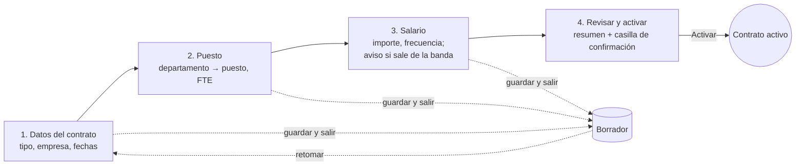

# 15 — Plan UX/UI

- **Estado:** Propuesto · P-1 y P-2 resueltas (marca propia y acceso móvil)
- **Fecha:** 2026-09-14
- **Relacionados:** [16 — Identidad de marca](16-identidad-de-marca.md) · [ADR-019 — Acceso móvil](../decisions/ADR-019-acceso-movil.md)
- **Alcance:** todas las pantallas actuales (Fases 2–4) y los patrones que necesitarán las Fases 5–8
- **Restricciones que no se negocian:** CSP estricta sin `unsafe-inline` ([ADR-007](../decisions/ADR-007-csp-estricta-con-nonce.md)),
  sin framework CSS salvo ADR, las plantillas **no** toman decisiones de seguridad
  ([§08](../architecture/08-arquitectura-django.md)), interfaz en español de Guatemala ([ADR-018](../decisions/ADR-018-estrategia-de-internacionalizacion.md))

---

## 1. Objetivo

Hoy el sistema **funciona y es seguro, pero no se puede usar con soltura**: las
reglas de negocio están en el código y la interfaz no las explica. El objetivo de
este plan es que cada rol complete sus tareas frecuentes **sin ayuda, sin errores
evitables y entendiendo por qué el sistema le impide algo**.

### Principios

1. **La tarea antes que la entidad.** RRHH no «crea un `EmploymentContract`»:
   contrata a alguien. Las pantallas se organizan por lo que la persona quiere
   lograr.
2. **Las reglas se ven antes de chocar con ellas.** Si un contrato no puede
   activarse sin salario y puesto, la pantalla lo muestra como una lista de
   pasos pendientes, no como un error al pulsar «Activar».
3. **Lo restringido se explica, no se esconde en silencio.** Donde un rol no ve
   un salario, aparece un bloque «Información restringida» con el motivo. Los
   datos **siguen sin llegar a la plantilla** (§J): esto es presentación, no control.
4. **Lo irreversible cuesta un paso más.** Dar de baja, suspender o desactivar
   pasan por una pantalla de confirmación que enumera las consecuencias.
5. **Accesible por defecto.** WCAG 2.2 nivel AA como requisito de aceptación,
   no como mejora posterior.
6. **Funciona sin JavaScript.** El JS mejora (mostrar contraseña, autoenvío),
   nunca es necesario para completar una tarea. Es coherente con la CSP y con
   equipos corporativos con navegadores restringidos.

---

## 2. Diagnóstico del estado actual

Observado al probar la aplicación a mano tras la Fase 4.

| # | Problema | Impacto | Dónde |
|---|---|---|---|
| D-01 | Navegación como fila de enlaces que se desborda horizontalmente en pantallas estrechas | Alto: en portátil pequeño o móvil no se llega a todas las secciones | `includes/navbar.html` |
| D-02 | Idioma mezclado: textos propios en inglés, textos de allauth en español | Alto: parece inacabado y confunde términos | Falta el catálogo `es_GT` (requiere `gettext`) |
| D-03 | Tablas, formularios y botones sin estilo | Alto: difícil escanear listados y distinguir la acción principal | Todas las pantallas salvo el login |
| D-04 | Contratar exige recorrer cuatro pantallas sin guía (borrador → salario → puesto → activar) y el error aparece al final | Alto: es la tarea central de la Fase 4 | `contracts/detail.html`, `form.html` |
| D-05 | «Activar» y «Suspender» son botones que actúan al instante, sin confirmación | Medio-alto: una suspensión por error cambia el estado laboral y queda auditada | `contracts/detail.html` |
| D-06 | El puesto se elige en un desplegable plano con todos los puestos de todos los departamentos | Medio: ADR-011 ya pedía «primero el departamento, luego el puesto» | `AssignmentForm` |
| D-07 | Empresas y jefaturas solo se gestionan desde el admin de Django | Medio: RRHH necesita al superusuario para tareas ordinarias | Admin |
| D-08 | Los estados (`ACTIVE`, `SUSPENDED`, `TERMINATED`…) se muestran como texto plano | Medio: no se distinguen de un vistazo | Listados y fichas |
| D-09 | La información restringida muestra un escueto «Restricted» | Bajo-medio: parece un fallo en lugar de una regla | `contracts/detail.html` |
| D-10 | No hay página de inicio por rol: tras entrar, la persona no ve qué tiene pendiente | Medio | `core/home.html` |
| D-11 | No hay migas de pan ni cabecera de entidad: en la ficha de un contrato no se sabe de quién es sin leer | Medio | Fichas |
| D-12 | Sin estados vacíos útiles («No employees found.» sin acción siguiente) | Bajo | Listados |

---

## 3. Usuarios y tareas

| Rol | Quién es | Tareas frecuentes | Dispositivo principal | Pantalla de inicio |
|---|---|---|---|---|
| `HR_ADMIN` | Responsable de RRHH | Contratar, cambiar salarios, dar de baja, invitar cuentas | Escritorio | Panel de RRHH: pendientes y vencimientos |
| `HR_MANAGER` | Analista de RRHH | Altas de empleados, asignar puestos, mantener fichas | Escritorio | Panel de RRHH sin importes |
| `MANAGER` | Jefe de departamento | Consultar su equipo; en Fase 6, aprobar ausencias | Escritorio y móvil | Mi equipo + bandeja de aprobaciones |
| `EMPLOYEE` | Cualquier empleado | Ver su ficha, su contrato, su salario; en Fases 6–8 solicitar ausencias y ver recibos | **Móvil** | Mi espacio |
| `AUDITOR` | Auditoría interna | Consultar fichas, contratos y bitácora, sin escribir | Escritorio | Búsqueda + bitácora |
| `SUPERADMIN` | Administración técnica | Configuración, roles, catálogos | Escritorio | Panel de RRHH + Administración |

**Consecuencia de diseño:** RRHH trabaja con densidad de información en
escritorio; el autoservicio del empleado y las vistas del jefe se diseñan
**primero para móvil** (320 px). El acceso desde el celular es un requisito
confirmado. Una app nativa futura consumirá una API construida sobre los mismos
`services` y `selectors`, con las reglas fijadas en [ADR-019](../decisions/ADR-019-acceso-movil.md).

---

## 4. Arquitectura de información

### 4.1 Navegación

Se sustituye la fila de enlaces por una **barra lateral agrupada**. Cada entrada
se muestra según los permisos del usuario, **por comodidad y no por seguridad**:
la vista vuelve a comprobar el permiso.

```
Inicio
Mi espacio              ← EMPLOYEE, y cualquier rol con ficha propia
  · Mi ficha
  · Mi contrato
Personas
  · Empleados
  · Contratos
Organización
  · Departamentos        (incluye jefaturas, D-07)
  · Puestos
  · Grados salariales
Administración
  · Cuentas
  · Empresas             (sale del admin de Django, D-07)
  · Bitácora             ← AUDITOR (fase posterior)
```

Fases futuras añaden **Asistencia** y **Ausencias** bajo *Personas*, y
**Documentos** y **Nómina** como grupos propios.

### 4.2 Estructura de cada página

```
┌──────────────┬──────────────────────────────────────────────────────┐
│  RH  Sistema │  Personas › Empleados › EMP-0042          [ES ▾] [👤] │ ← barra superior: migas, idioma, cuenta
│              ├──────────────────────────────────────────────────────┤
│  Inicio      │  Ana Pérez López                 ● Activo            │ ← cabecera de página
│  Mi espacio  │  EMP-0042 · Desarrolladora II · Tecnología           │
│  Personas    │                          [Editar]  [Más acciones ▾]  │
│   Empleados  ├──────────────────────────────────────────────────────┤
│   Contratos  │  Resumen | Datos personales | Documentos | Contratos │ ← pestañas (enlaces, no JS)
│  Organización│                                                      │
│  …           │  (contenido)                                         │
└──────────────┴──────────────────────────────────────────────────────┘
```

---

## 5. Patrones de pantalla

Cada pantalla nueva se construye con uno de estos patrones. Si ninguno encaja, se
discute antes de inventar uno.

| Patrón | Uso | Elementos obligatorios |
|---|---|---|
| **Listado** | Empleados, contratos, departamentos, puestos, cuentas | Cabecera con título y acción primaria · filtros arriba (búsqueda + estado) · tabla con `<th scope>` · estado como insignia · paginación · **estado vacío con la acción siguiente** |
| **Ficha** | Empleado, contrato, departamento, puesto | Migas · cabecera de entidad (nombre, código, insignia de estado, dato clave) · acciones agrupadas (primaria visible, resto en «Más acciones») · pestañas como enlaces con `aria-current` |
| **Formulario** | Crear y editar | Secciones con título · etiqueta visible y ayuda bajo el campo · errores junto al campo **y** resumen arriba · botón primario a la derecha, «Cancelar» como enlace |
| **Asistente** | Contratar (D-04); más adelante, alta completa de empleado | Indicador de pasos · cada paso guarda (no se pierde nada al salir) · el último paso resume y activa · se puede retomar un borrador |
| **Confirmación** | Baja, suspensión, desactivación (D-05) | Página propia (no modal) · qué va a pasar, en lista · qué **no** se puede deshacer · botón con verbo explícito («Dar de baja a Ana Pérez») · formulario POST con CSRF |
| **Historial** | Salarios, puestos, jefaturas (ADR-014) | Línea de tiempo vertical · período vigente destacado · motivo y justificación de cada cambio |
| **Información restringida** | Salario sin `view_salary`, PII sin permiso (D-09) | Bloque con candado · «No tiene permiso para ver esta información» · **nunca** el dato, ni oculto por CSS |
| **Error** | 403, 404, 500 | Explicación en lenguaje llano · enlace a Inicio · sin detalles técnicos (§K) |

### 5.1 Reglas de interacción

- **Selector dependiente departamento → puesto** (D-06, ADR-011). Sin JS: se
  elige el departamento, se envía y se muestran sus puestos. Con JS: se filtra
  el segundo desplegable en el acto. En ambos casos el servidor valida.
- **Las acciones no disponibles no se ocultan en flujos guiados:** se muestran
  deshabilitadas con el motivo. «Activar contrato (falta el salario inicial)»
  enseña más que un botón ausente.
- **Mensajes de resultado** tras cada acción, en la parte superior, con
  `role="status"`; los errores con `role="alert"`.
- **Fechas** con selector nativo `type="date"`; se muestran como `dd/mm/aaaa`.
- **Importes** con prefijo de moneda y formato de Guatemala: `Q 7,000.00`.

---

## 6. Sistema de diseño

### 6.1 Decisión técnica

CSS propio organizado en **capas** (`@layer tokens, base, components, utilities`)
dentro de `static/css/`. Motivos: la CSP prohíbe estilos en línea, no se quiere
una dependencia de CDN y el volumen de pantallas no justifica un framework.
**Adoptar uno exigiría un ADR** (candidato: ADR-020).

Iconos como **sprite SVG local** (`static/img/icons.svg`), referenciados con
`<use>`: compatibles con `img-src 'self'` y sin fuentes de iconos externas.

### 6.2 Tokens

| Grupo | Valores |
|---|---|
| Color de marca | Jade: primario `#0F6E5C` · hover `#0B574A` · oscuro `#083A32` · tinte `#E8F4F1` · acento maíz `#E8A92B` (detalle en el documento [16](16-identidad-de-marca.md#3-color)) |
| Neutros | Fondo `#F4F7F6` · superficie `#FFFFFF` · borde `#D5DEDB` · borde de control `#8A9692` · texto `#17201E` · texto secundario `#5B6763` |
| Semánticos | Éxito `#1F6B35`/`#E6F4EA` · aviso `#7A4F00`/`#FFF3DC` · error `#A3261D`/`#FDECEA` · información `#1D5FA8`/`#E7F0FA` · neutro `#4A5552`/`#ECEFEE` |
| Tipografía | `system-ui` (sin fuentes externas) · escala 12 / 14 / 16 / 20 / 24 / 32 px · cifras tabulares en tablas e importes |
| Espaciado | Base 4 px: 4, 8, 12, 16, 24, 32, 48 |
| Radios y sombras | 6 px controles · 12–16 px tarjetas · una sombra para tarjetas y otra para menús |

Todo par texto/fondo debe cumplir **contraste 4,5:1** (3:1 en texto grande e
iconos). Se verifica al definir el token, no en cada pantalla.

### 6.3 Estados del dominio

El color **nunca** es la única señal: la insignia siempre lleva texto.

| Estado | Insignia |
|---|---|
| Contrato `DRAFT` | Información · «Borrador» |
| `ACTIVE` | Éxito · «Activo» |
| `SUSPENDED` | Aviso · «Suspendido» |
| `TERMINATED` | Neutro · «Terminado» |
| `EXPIRED` | Neutro oscuro · «Vencido» |
| Empleado `ON_LEAVE` (Fase 6) | Información · «De licencia» |

### 6.4 Inventario de componentes

| Componente | Prioridad | Notas |
|---|---|---|
| Estructura de la app (barra lateral + barra superior) | P0 | Barra lateral colapsable con `<details>`, sin JS |
| Cabecera de página y migas | P0 | |
| Botón (primario, secundario, peligro, enlace) | P0 | Área táctil mínima de 44 px en móvil |
| Campo de formulario (etiqueta, ayuda, error) | P0 | Extiende `includes/form_fields.html` |
| Tabla | P0 | Filas de 44 px, cabecera fija en listados largos, desplazamiento horizontal **dentro** de su contenedor |
| Insignia de estado | P0 | |
| Alerta y mensajes | P0 | |
| Estado vacío | P0 | Icono, texto y acción siguiente |
| Paginación | P0 | Ya existe; se restiliza |
| Tarjeta | P1 | Resúmenes e inicio |
| Pestañas | P1 | Enlaces con `aria-current="page"` |
| Indicador de pasos | P1 | Asistente de contratación |
| Línea de tiempo | P1 | Historial salarial y de puestos |
| Bloque de información restringida | P1 | |
| Avatar de iniciales | P2 | Sin fotos hasta la Fase 7 |
| Indicador numérico (KPI) | P2 | Panel de RRHH |

---

## 7. Pantallas clave

### 7.1 Inicio por rol (D-10)

- **RRHH:** cuatro indicadores (empleados activos, contratos en borrador,
  contratos que vencen en 30 días, empleados sin contrato) y dos listas de
  trabajo: *Borradores por activar* y *Próximos vencimientos*. Los importes
  **no** aparecen en el inicio: se evita exponer salarios en una pantalla que se
  deja abierta.
- **MANAGER:** *Mi equipo* (nombre, puesto, estado) y, en la Fase 6, *Solicitudes
  por aprobar*.
- **EMPLOYEE:** tarjeta con su puesto, departamento y antigüedad; accesos a
  *Mi ficha* y *Mi contrato*.

### 7.2 Asistente de contratación (D-04)



- El puesto va **antes** que el salario: así el paso 3 puede mostrar la banda
  del grado y avisar **antes** de guardar que hará falta justificación (RN-23).
- Cada paso llama a los servicios existentes; el asistente es solo presentación.
  Las invariantes siguen en `contracts.services`.
- Si el mínimo legal está configurado (RN-22), el paso 3 muestra el equivalente
  mensual calculado.

### 7.3 Ficha de contrato

- Cabecera: persona (enlace a su ficha), tipo, insignia de estado y vigencia.
- Si es **borrador**: lista de verificación «Para activar este contrato falta:
  ☐ salario inicial ☐ puesto principal», con enlace a cada paso.
- Pestañas *Resumen · Salario · Puestos · Historial de estados*.
- Acciones según estado: *Suspender* y *Dar de baja* van en «Más acciones» y
  llevan a sus páginas de confirmación.
- **Separación de funciones visible:** si quien mira es el titular, las
  acciones no se muestran y aparece la nota «No puede modificar su propia
  relación laboral». El servicio sigue siendo quien lo impide (Fase 4, H-1).

### 7.4 Confirmación de baja

```
Dar de baja a Ana Pérez López (EMP-0042)

Al confirmar:
  • El contrato pasará a «Terminado» con fecha 30/06/2026.
  • Se cerrarán su salario y su puesto en esa fecha.
  • Su cuenta de acceso se desactivará y se cerrarán sus sesiones.
  • Dejará de aparecer en el equipo de su jefe.

Esta acción no se puede deshacer. Una recontratación crea un contrato nuevo.

Fecha de baja [30/06/2026]   Motivo [Renuncia ▾]

[Cancelar]                          [Dar de baja a Ana Pérez]
```

### 7.5 Listado de empleados

- Filtros: búsqueda por nombre o código, estado, departamento.
- Columnas: avatar e iniciales, nombre, código, puesto actual, departamento,
  estado. **Nunca** DPI ni fecha de nacimiento en el listado (§G.19).
- En móvil: cada fila se convierte en una tarjeta con nombre, puesto y estado.

---

## 8. Contenido y lenguaje

- **Prerrequisito bloqueante:** generar y traducir el catálogo `es_GT` (D-02).
  Sin él, cualquier trabajo visual seguirá pareciendo inacabado. Requiere
  instalar `gettext` en la máquina de desarrollo.
- **Tono:** usted, frases cortas, verbos en infinitivo en los botones
  («Guardar contrato», no «Enviar»).
- **Errores:** qué pasó y cómo resolverlo. «El salario está fuera de la banda del
  puesto (Q 6,000–9,000). Añada una justificación.» en lugar de «Datos inválidos».
  Los códigos de dominio ya existen; falta redactar sus mensajes con este criterio.

### Glosario de interfaz

| En el código | En pantalla |
|---|---|
| `EmploymentContract` | Contrato |
| `Assignment` | Puesto asignado |
| `JobGrade` | Grado salarial |
| `ContractSalary` | Salario |
| `DepartmentHeadship` | Jefatura |
| `terminate` | Dar de baja |
| `FTE` | Jornada (%) — se muestra `100 %`, no `1.00` |
| `DRAFT` | Borrador |

---

## 9. Accesibilidad (WCAG 2.2 AA)

| Criterio | Cómo se cumple |
|---|---|
| Contraste | Tokens verificados (§6.2) |
| Teclado | Todo operable con Tab/Shift+Tab/Enter; orden de foco lógico; sin trampas de foco (no hay modales) |
| Foco visible | `:focus-visible` con contorno de 3 px ya definido; no se elimina nunca |
| Estructura | Landmarks `header`, `nav`, `main`; un único `h1` por página; enlace «Saltar al contenido» (ya existe) |
| Tablas | `<caption>` y `<th scope>` (ya exigido en §08) |
| Formularios | Etiqueta visible, `aria-describedby` hacia ayuda y error, `autocomplete` en datos personales |
| Estados | Texto además de color (§6.3) |
| Tamaño de objetivo | Mínimo 24×24 px (WCAG 2.5.8); 44 px en móvil |
| Zoom y reflujo | Usable al 200 % y a 320 px de ancho sin desplazamiento horizontal de página |
| Movimiento | `prefers-reduced-motion` respetado (ya en el CSS) |
| Idioma | `lang` en `<html>` (ya existe) |

---

## 10. Responsive

| Ancho | Navegación | Tablas | Formularios |
|---|---|---|---|
| ≥ 1024 px | Barra lateral fija | Completas | Dos columnas donde tenga sentido |
| 640–1023 px | Barra lateral plegable (`<details>`) | Desplazamiento horizontal dentro del contenedor | Una columna |
| < 640 px | Barra superior con menú | Filas convertidas en tarjetas | Una columna, botones a ancho completo |

---

## 11. Restricciones técnicas y de seguridad

- **Sin estilos, scripts ni manejadores en línea.** Ya lo vigila
  `tests/security/test_template_safety.py`.
- **Sin modales que dependan de JS** para acciones críticas: las confirmaciones
  son páginas con formulario POST y CSRF.
- **Las plantillas no deciden seguridad.** Ocultar un botón es comodidad; el
  permiso lo comprueba la vista y el alcance el selector.
- **Ningún dato restringido llega a la plantilla** para luego ocultarlo con CSS.
- **Títulos de pestaña del navegador** sin PII sensible: código de empleado sí;
  DPI o salario, nunca (quedan en el historial del navegador).
- **Inicio sin importes**, por pantallas que se quedan abiertas (§7.1).
- **Comentarios de plantilla de varias líneas** con ``: un `{# #}`
  de varias líneas se muestra en pantalla (detectado y ya cubierto por prueba).

---

## 12. Plan de entrega

Las entregas UX se intercalan con el roadmap funcional: la UX-4 debe hacerse
**antes** de construir las Fases 5 y 6, no después.

| Entrega | Contenido | Resuelve | Tamaño | Criterio de cierre |
|---|---|---|---|---|
| **UX-0 · Prerrequisitos** ✅ | Instalar `gettext`, generar y traducir el catálogo `es_GT`; aprobar el glosario (§8) | D-02 | S | **Hecho:** 556 cadenas traducidas, `msgfmt --check` y `check_translations.py` en verde; la aplicación responde en español (`lang="es-gt"`) |
| **UX-1 · Fundamentos** ✅ | Tokens y capas CSS ([ADR-020](../decisions/ADR-020-css-propio.md)), estructura de la app (barra lateral, barra superior, migas), componentes P0, iconos SVG locales, páginas de error | D-01, D-03, D-08, D-12 | M | **Hecho:** las 21 pantallas usan la estructura nueva; `tests/test_app_shell.py` vigila herencia de base, tablas accesibles, insignias, navegación y paginación con filtros |
| **UX-2 · Pantallas de las Fases 3–4** ✅ | Listados y fichas con los patrones, pestañas, línea de tiempo, bloque restringido, confirmaciones, selector departamento → puesto | D-05, D-06, D-09, D-11 | L | **Hecho:** seis acciones de estado con página de confirmación (el `GET` ya no cambia nada), ficha con pestañas Ficha/Documentos/Contratos, historial salarial como línea de tiempo y puestos agrupados por departamento |
| **UX-3 · Flujos guiados y autoservicio** ✅ | Asistente de contratación, inicio por rol, *Mi espacio*, gestión de empresas y jefaturas fuera del admin | D-04, D-07, D-10 | L | **Hecho:** asistente de 3 pasos deducidos del estado (se abandona y se retoma), inicio distinto para RRHH, jefatura y empleado, y alta de empresas y nombramiento de jefaturas desde la aplicación |
| **UX-4 · Patrones de las Fases 5–8** ✅ | Bandeja de aprobaciones, calendario de ausencias, registro de marcajes, subida y descarga de documentos, recibo de nómina | — | M | **Hecho:** [17 — Patrones de las Fases 5 a 8](17-patrones-fases-5-8.md), con reglas transversales, accesibilidad, pruebas exigidas y cinco preguntas para el negocio. Cada sección se **aprueba** al abrir su fase |
| **UX-5 · Validación con usuarios** | Pruebas moderadas con 3–5 personas por rol principal (HR_ADMIN, MANAGER, EMPLOYEE) | — | M | Metas de §13 alcanzadas o hallazgos priorizados en el backlog |

**Estado:** UX-0 a UX-4 entregadas (2026-09-17). Queda **UX-5**, las pruebas con
usuarios, que necesitan datos reales y personas de cada rol: se hace cuando el
sistema esté cargado, no antes.

**Decisión estructural de UX-3:** el inicio vive en una app nueva, `dashboard`,
porque necesita datos de `employees` y `contracts` y `core` no puede depender de
ningún dominio (ADR-001). La gestión de empresas y jefaturas se añadió a
`departments`, que es la app de la estructura organizativa y ya audita.

**Pendiente que nace de UX-1:** pasar `STORAGES` a `ManifestStaticFilesStorage`
antes de producción; sin hash en el nombre, el navegador sirve el CSS anterior
tras cada cambio.

**Orden recomendado:** UX-0 → UX-1 → UX-2 → UX-3, antes de la Fase 5. UX-4 se
hace al abrir cada fase funcional; UX-5, al terminar UX-3.

---

## 13. Métricas y validación

| Métrica | Meta | Cómo se mide |
|---|---|---|
| Tiempo para contratar a una persona (catálogo ya existente) | < 5 min | Prueba moderada, HR_ADMIN |
| Tareas completadas sin ayuda | ≥ 90 % | Prueba moderada: contratar, cambiar salario, dar de baja, consultar mi contrato |
| Errores de validación por contratación | ≤ 1 | Prueba moderada |
| Satisfacción (SUS) | ≥ 75 | Cuestionario tras la prueba |
| Accesibilidad | 0 fallos AA | Recorrido con teclado y lector de pantalla (NVDA) en las pantallas P0 |
| Reflujo | Sin scroll horizontal a 320 px | Revisión manual en cada entrega |

### Verificación automatizada (se añade a la suite)

- Toda plantilla de página extiende `base.html` o `account/base_entrance.html`.
- Toda `<table>` tiene `<th scope>` y `<caption>`.
- Toda acción destructiva (baja, suspensión, desactivación) se hace por POST desde
  una página de confirmación, nunca desde un botón directo en una ficha.
- *Render* de cada vista de la matriz para cada rol sin errores (reutiliza las
  pruebas de autorización existentes).
- Ninguna cadena sin traducir en `es_GT` (ya existe `check_translations.py`).

---

## 14. Decisiones abiertas

| # | Pregunta | Para quién | Bloquea |
|---|---|---|---|
| ~~P-1~~ | ~~¿Hay identidad corporativa?~~ **Resuelta:** no la hay; se creó la marca propia **Ceiba RH** ([16](16-identidad-de-marca.md)). Pendiente verificar la disponibilidad de la marca registrada | Negocio | — |
| ~~P-2~~ | ~~¿Se usará desde el móvil?~~ **Resuelta:** sí. Web responsive primero para autoservicio y jefes; API para app nativa en la Fase 10 ([ADR-019](../decisions/ADR-019-acceso-movil.md)) | Negocio | — |
| P-3 | ¿Qué indicadores quiere ver RRHH al entrar? (§7.1 es una propuesta) | RRHH | UX-3 |
| P-4 | ¿Se necesita imprimir o exportar fichas y contratos? | RRHH / legal | UX-2 (estilos de impresión) |
| P-5 | ¿Modo oscuro? Propuesta: no en la primera versión | Producto | Nada |
| P-6 | ¿Se mantiene CSS propio o se adopta un framework? Propuesta: CSS propio (ADR-020) | Equipo técnico | UX-1 |
