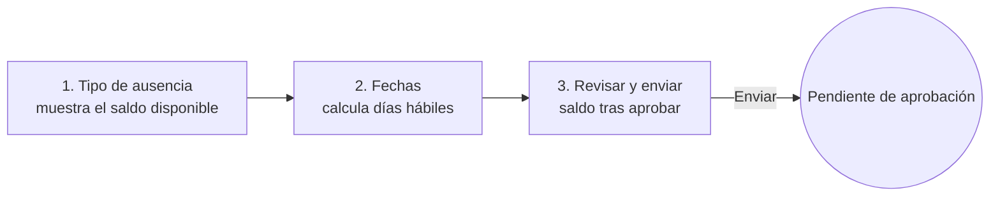

# 17 — Patrones de las Fases 5 a 8 (entrega UX-4)

- **Estado:** Propuesto · cada sección se aprueba **al abrir su fase**, con el negocio
- **Fecha:** 2026-09-17
- **Alcance:** asistencia (Fase 5), ausencias (Fase 6), documentos (Fase 7) y nómina (Fase 8)
- **Relacionados:** [15 — Plan UX/UI](15-plan-ux-ui.md) · [16 — Identidad de marca](16-identidad-de-marca.md) · [10 — Autorización](../security/10-autorizacion.md) · [11 — Seguridad §K.4](../security/11-seguridad.md#k4-seguridad-de-archivos)

---

## 1. Para qué sirve este documento

Las Fases 5 a 8 todavía no existen. Definir ahora sus patrones evita el error más
caro de la interfaz: construir cada fase con su propio criterio y descubrir al
final que hay cuatro maneras distintas de aprobar algo.

**No se construye nada de esto todavía** (regla 56). Cada sección es el contrato
que la fase debe cumplir cuando se abra, y su lista de verificación.

### Lo que ya está resuelto y no se rediscute

Las Fases 5 a 8 heredan lo entregado en UX-1 a UX-3 y **no crean variantes**:

| Necesidad | Patrón que ya existe |
|---|---|
| Listar cosas | Listado con filtros, insignias, estado vacío y paginación |
| Ver una entidad | Ficha con cabecera, migas y pestañas |
| Capturar datos | Formulario en tarjeta, con secciones y acciones al pie |
| Proceso de varios pasos | Asistente con el paso deducido del estado (no de la sesión) |
| Acción irreversible | Página de confirmación con las consecuencias en lista |
| Historia con vigencia | Línea de tiempo, con el período actual destacado |
| Dato que no se puede ver | Bloque de información restringida, con el motivo |
| Resumen de trabajo pendiente | Indicadores del inicio, **sin importes** |

### Componentes nuevos, y solo cuando su fase los necesite

| Componente | Fase | Por qué no vale uno existente |
|---|---|---|
| Bandeja de aprobaciones | 6 | Es una lista de **decisiones**, no de registros: cada fila lleva el efecto de decidir |
| Calendario mensual | 6 | Ver ausencias por día es una cuadrícula temporal, no una tabla de filas |
| Acción de marcaje | 5 | Una sola acción grande, pensada para el móvil y para hacerse en segundos |
| Campo de archivo con requisitos | 7 | La validación en cadena (§K.4) exige explicar los límites **antes** de elegir el archivo |
| Tarjeta de saldo | 6 | Devengado, consumido y disponible se leen juntos o no significan nada |
| Recibo imprimible | 8 | Documento, no pantalla: se imprime y se archiva |

---

## 2. Fase 5 — Asistencia

### 2.1 Pantallas

| Pantalla | Quién | Patrón |
|---|---|---|
| Mi asistencia | Cualquiera con contrato vivo | Ficha propia, **móvil primero** |
| Registrar marcaje | Empleado y jefatura (su área) | Acción de marcaje |
| Asistencia del equipo | Jefatura | Listado con filtro de fechas |
| Incidencias y ajustes | RRHH | Listado + confirmación con motivo |
| Reporte por período | RRHH y auditoría | Listado con exportación |

### 2.2 La acción de marcaje

```
┌──────────────────────────────┐
│  Martes 17 de marzo          │
│  08:02  Entrada registrada   │
│                              │
│   ┌────────────────────────┐ │
│   │   Registrar salida     │ │  ← una sola acción, 56 px de alto
│   └────────────────────────┘ │
│                              │
│  Hoy: 4 h 12 min             │
└──────────────────────────────┘
```

- **Una sola acción visible.** El sistema sabe si toca entrada o salida; no se le
  pregunta a la persona.
- **Funciona sin JavaScript:** es un `POST` con CSRF. Con JavaScript, el reloj se
  actualiza en vivo, que es decoración.
- **Sin contrato vivo no hay botón** (RN-52): en su lugar, una explicación. Una
  acción deshabilitada sin motivo enseña menos que una frase.
- **El registro no se edita nunca**: se corrige con una incidencia que deja
  actor, fecha y motivo (RN-53).

### 2.3 Ajustes: confirmación con motivo

Corregir un marcaje mueve datos que alimentan la nómina. Usa el patrón de
confirmación, con el motivo **obligatorio** y la comparación antes/después:

```
Ajustar marcaje de Ana Pérez · 17/03/2026

  Antes:    08:02 – 17:15
  Después:  08:02 – 18:30

  • El ajuste queda registrado con su nombre y la hora.
  • La asistencia del período se recalcula.

  Motivo [___________________________]   (obligatorio)

  [Cancelar]                 [Ajustar marcaje]
```

### 2.4 Privacidad

- La asistencia del equipo muestra **horas y ausencias**, nunca ubicación.
- Si el negocio pide geolocalización en el marcaje, es una decisión con ADR
  propio (P-7): cambia la clasificación de los datos y exige aviso explícito a la
  persona antes del primer marcaje.

---

## 3. Fase 6 — Ausencias

### 3.1 Solicitar: asistente corto

Tres pasos, con el mismo mecanismo que el de contratación (el paso se deduce del
estado, se puede abandonar y retomar):



- El paso 2 muestra **los días hábiles calculados** (RN-42), no los naturales: es
  la cifra que descuenta el saldo, y verla evita la mitad de las correcciones.
- El paso 3 muestra el **saldo resultante**. Si quedara negativo y el tipo no lo
  permite (RN-43), se explica antes de enviar, no al aprobar.
- Un traslape con otra solicitud (RN-41) se detecta en el paso 2, con enlace a la
  solicitud que estorba.

### 3.2 Bandeja de aprobaciones

```
Solicitudes por aprobar (3)

┌───────────────────────────────────────────────────────────────┐
│ Ana Pérez · EMP-0042                         ● Pendiente      │
│ Vacaciones · 12–16 may · 5 días hábiles                        │
│ Saldo tras aprobar: 7 días                                     │
│                                   [Rechazar]   [Aprobar]       │
├───────────────────────────────────────────────────────────────┤
│ Luis García · EMP-0051                       ● Pendiente      │
│ Permiso personal · 3 jun · 1 día hábil                         │
│ Saldo tras aprobar: 2 días                                     │
│                                   [Rechazar]   [Aprobar]       │
└───────────────────────────────────────────────────────────────┘
```

Reglas del patrón:

1. **Cada fila muestra el efecto de decidir** (días hábiles y saldo resultante).
   Aprobar sin ver la consecuencia es firmar a ciegas.
2. **La propia solicitud aparece sin acciones**, con la nota «No puede aprobar su
   propia solicitud» (RN-44). No se oculta: esconderla haría pensar que se perdió.
3. **Aprobar** pasa por confirmación breve; **rechazar** exige motivo, que la
   persona verá.
4. Ambas acciones son `POST` con CSRF y quedan auditadas.
5. Tras decidir, la fila desaparece de la bandeja y aparece en el historial.

### 3.3 Calendario del equipo

Cuadrícula mensual, implementada como **tabla** con `<th scope="col">` por día y
`<th scope="row">` por persona: se lee con teclado y lector de pantalla.

| | 1 | 2 | 3 | 4 | 5 |
|---|---|---|---|---|---|
| Ana Perez | | | X | X | |
| Luis Garcia | X | | | | |

- **El calendario dice quién no está, no por qué.** El tipo de ausencia se
  muestra solo a RRHH y a la propia persona: hay tipos que revelan información de
  salud, que es dato sensible (§G.19). Para el resto, «Ausente».
- Cada celda ocupada lleva texto alternativo con el nombre y las fechas; el color
  nunca es la única señal.

### 3.4 Saldo

```
Vacaciones 2026
  Devengado    15 días
  Consumido     8 días
  ─────────────────────
  Disponible    7 días          [Ver movimientos]
```

«Ver movimientos» abre el **ledger**: asientos con fecha, motivo y documento que
los originó. Los asientos no se editan ni se borran nunca (RN-46, ADR-015): una
corrección es un asiento nuevo de reversa.

---

## 4. Fase 7 — Documentos

### 4.1 Subir: los requisitos antes del archivo

```
Subir documento · Ana Pérez (EMP-0042)

  Tipo de documento  [ Contrato firmado ▾ ]

  Para este tipo:
   • Formatos: PDF
   • Tamaño máximo: 10 MB
   • Vence: sí, indique la fecha

  Archivo   [ Seleccionar archivo ]
  Vence el  [ dd/mm/aaaa ]

  [Cancelar]                          [Subir documento]
```

- **El tipo se elige primero** porque determina formatos y tamaño: pedir el
  archivo antes es invitar a que lo rechacen.
- Los límites se muestran **antes** de elegir, no en el mensaje de error.
- Cada paso de la cadena de validación (§K.4) tiene su mensaje en lenguaje llano:
  «El archivo dice ser PDF pero su contenido no lo es» explica más que «Archivo
  inválido», y no revela detalles internos.
- El nombre del archivo subido se muestra escapado; **nunca** se usa como ruta.

### 4.2 Ver y descargar

- La lista vive en la pestaña *Documentos* de la ficha, que ya existe.
- **No hay enlaces directos a `/media/`.** La descarga pasa por una vista que
  autoriza y audita (`DOCUMENT_DOWNLOAD`): un enlace filtrado no debe servir de
  llave.
- Un documento de tipo sensible que la persona no puede ver aparece como bloque
  restringido: se sabe que **existe** (RRHH lo necesita para pedirlo) pero no su
  contenido, salvo que la clasificación diga lo contrario.
- **Vencimientos:** insignia «Vence en N días» y lista en el inicio de RRHH,
  reutilizando el patrón de «Contratos por terminar».

---

## 5. Fase 8 — Nómina

### 5.1 Mi recibo (empleado, móvil primero)

- Es un **documento**, no una pantalla de trabajo: sin acciones, sin edición.
- Estilos de impresión propios (`@media print`): sin barra lateral ni botones,
  con el logotipo horizontal y los datos del patrono.
- Los importes se alinean a la derecha con cifras tabulares; el neto se destaca.
- El recibo muestra el **snapshot** del período (ADR-016 cuando se escriba): lo
  que se pagó, no lo que hoy diría el contrato.

### 5.2 Corrida de nómina (RRHH)

Asistente por etapas, con el mismo mecanismo de siempre:

```
[1 Preparar] → [2 Revisar diferencias] → [3 Aprobar] → [4 Cerrar]
```

- **La etapa 2 muestra diferencias contra el período anterior**, no una lista
  plana de importes: lo que hay que revisar es lo que cambió.
- **Aprobar y cerrar** son acciones irreversibles: confirmación con consecuencias
  y, tras el cierre, la corrida queda de solo lectura, como el admin de contratos.
- El estado de la corrida usa insignias de la paleta semántica ya definida.

### 5.3 Confidencialidad

- Los importes **solo** en el detalle y en el recibo propio. Nunca en listados
  generales, nunca en el inicio (regla ya fijada en §7.1 del plan).
- Toda consulta de un recibo ajeno se audita, con el criterio de `SALARY_VIEW`:
  se registra el acceso de terceros, no el propio.

---

## 6. Reglas transversales que fija esta entrega

1. **Toda decisión muestra su efecto antes de tomarse**: días hábiles, saldo
   resultante, diferencias contra el período anterior.
2. **Toda acción irreversible o que mueva saldos** pasa por página de
   confirmación con consecuencias en lista.
3. **Nada sensible viaja en la URL**: los recursos se direccionan por `public_id`.
4. **Ningún flujo nuevo inventa un componente** que ya exista en UX-1 a UX-3.
5. **El color nunca es la única señal**, también en calendarios y estados de corrida.
6. **Los errores hablan en lenguaje llano** y salen de un código de dominio
   estable, como en el resto del sistema.

---

## 7. Accesibilidad específica

| Pantalla | Requisito |
|---|---|
| Calendario | Tabla con `caption` y `th scope`; cada celda ocupada con texto, no solo color; navegable con teclado |
| Bandeja | Cada acción nombra su objeto: «Aprobar la solicitud de Ana Pérez», no «Aprobar» a secas (WCAG 2.4.6) |
| Marcaje | Objetivo táctil ≥ 44 px; confirmación anunciada con `role="status"` |
| Subida | Errores con `role="alert"` y asociados al campo con `aria-describedby` |
| Recibo | Tabla con `caption`, totales en `tfoot`, contraste válido también impreso en blanco y negro |

---

## 8. Verificación que cada fase debe traer

| Fase | Prueba mínima |
|---|---|
| 5 | Sin contrato vivo no se puede marcar (RN-52) · un ajuste sin motivo se rechaza · el marcaje es `POST` |
| 6 | La bandeja **nunca** ofrece acciones sobre la propia solicitud (RN-44) · el calendario no revela tipos sensibles a terceros · aprobar asienta en el ledger y cancelar asienta la reversa (RN-46) |
| 7 | La descarga siempre pasa por la vista y queda auditada · un archivo con extensión falsa se rechaza · no existe URL directa a `/media/` |
| 8 | El recibo no ofrece acciones de edición · una corrida cerrada es de solo lectura · ningún listado general muestra importes |

Además, cada fase mantiene los criterios generales de UX-1: toda página extiende
la base, toda tabla es accesible y todo icono existe en el sprite.

---

## 9. Preguntas abiertas para el negocio

| # | Pregunta | Bloquea |
|---|---|---|
| P-7 | ¿El marcaje requiere geolocalización? Cambia la clasificación de los datos y exige ADR y aviso previo | Fase 5 |
| P-8 | ¿Qué tipos de ausencia se consideran sensibles y se ocultan en el calendario del equipo? | Fase 6 |
| P-9 | ¿Quién aprueba cuando la jefatura está ausente? ¿Sube al departamento superior o lo asume RRHH? | Fase 6 |
| P-10 | ¿El recibo debe seguir un formato exigido por la ley o por la empresa? | Fase 8 |
| P-11 | ¿Se necesita exportar asistencia y nómina a Excel, o basta con PDF e impresión? | Fases 5 y 8 |
